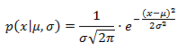

# non-linear Conjugate Gradient


[](http://www.apache.org/licenses/LICENSE-2.0.txt)

A simple implementation of non linear Conjugate Gradient in C/C++ language, in a code::block windows project.

This implementation was created for academic use, but can be [adapted] for commercial usage. 

It is basically the implementation of the algorithm [1]:

<p align="center">
  
</p>


## Use Cases

Use this for:

- If you just want a simple, fast, general implementation
- High-latency applications
- Easy to use code to test concepts and modify easily


## Compilation

```
g++.exe -Wall -fexceptions -O2 -Os -Wall -std=c++11 -m64 -Iinclude -c main.cpp -o obj\Release\main.o
g++.exe  -o bin\Release\nonLinearConjugateGradient.exe obj\Release\main.o obj\Release\src\NonLinearCG.o  -s -m64  
```


## Usage

Simple usage:

```c++
int main()
{
    double _deltaX = 0.01;
    double _error = 0.5;
    double _step = 0.01;
    long N = 40;

    // 1 - RANDOM NUMBER INITIALIZATION
    std::default_random_engine generator(std::chrono::system_clock::now().time_since_epoch().count());
    std::uniform_real_distribution<double> distribution(-1000.0, +1000.0);

    // 2 - DEFINITION OF DECISION VARIABLE X VECTOR
    vector<double> x(N, 0.0);
    for(int i=0;i<N;i++)
        x[i] = distribution(generator);
    cout<< "-------------------------------------------"<< endl;

    // 3 - DEFINITION OF THE OBJECT ASSOCIATED TO THE METHOD
    NonLinearCG nlCG(_error, _step, _deltaX, x, f, true);

    // 4 - EXECUTION OF THE METHOD
    cout<< "EXECUTING ..."<< endl;
    nlCG.execute();

    // 5 - SHOW THE SOLUTION FOUND
    cout<< "-------------------------------------------"<< endl;
    cout<< "min F(X*): "<< f(x) << endl;

    return 0;
}

```

The code above is an example of a simple way to use the target class call NonLinearCG. 
follow the steps:


1. Random number initialization. After this, we can get a distribution that produces floating-point values between the intervals [-1000, +1000] according to a normal distribution, which is described by the following probability density function [2]:

<p align="center">
  
</p>

2. Definition of a vector of N size, which will be used as a decision variable vector.

3. Here is needed to instantiate the object NonLinearCG() and the following parameters is obligatory:
   - error: used as a stop criterion to finish the iterative process of the method;
   - step: the known "alpha" variable used into the method in order to define the size of step of convergence; 
   - deltaX: the size used in the differentiation dy/dx;
   - x: the decision variable vector;
   - f: function which one wants to find the minimum value. An example of sphere function could be something like this:

```c++
double f(vector<double> &x)
{
    double r=0.0;
    //Sphere function
    for(int i=0;i<x.size();i++)
        r += (x[i] * x[i]);
    return r;
} 
```
 
   - printable: a parameter to indicate to print the inner execution informations;
 
4. Execution of the method by calling execute() function.

5. Show the X vector results.


# Execution Example

  Considering deltaX = 0.01, error = 0.1, step = 0.05 and sphere function with 2 dimension, we could obtain a convergence result like this:
``` 
-------------------------------------------
EXECUTING ...
grad_start[0]: -1277.33
grad_start[1]: 1603.95
k[0] --------> f(x): 1.05107e+06
-------------------------------------------
-------------------------------------------
-------------------------------------------
[k] f(x)        error
-------------------------------------------
[1] 851383      2593.17
[2] 558605      2100.49
[3] 310965      1567.19
[4] 157013      1113.6
[5] 75701.2     773.23
[6] 35811.4     531.814
[7] 16818.2     364.442
[8] 7877.24     249.407
[9] 3686.08     170.6
[10] 1724.42    116.677
[11] 806.752    79.7959
[12] 377.506    54.5753
[13] 176.71     37.3296
[14] 82.7621    25.5373
[15] 38.7922    17.4739
[16] 18.2038    11.9604
[17] 8.55688    8.19039
[18] 4.03224    5.6125
[19] 1.907      3.84973
[20] 0.906676   2.64429
[21] 0.434412   1.81989
[22] 0.21048    1.25597
[23] 0.10364    0.870051
[24] 0.0522168  0.605726
[25] 0.0271603  0.424372
[26] 0.0147412  0.299539
[27] 0.00843877 0.213115
[28] 0.00513517 0.152732
[29] 0.003326   0.110024
[30] 0.00227806 0.091273
-------------------------------------------
min F(X*): 0.00227806
```


## References:

[1.] [Conjugate gradient method](<https://en.wikipedia.org/wiki/Conjugate_gradient_method> "Wikipedia:Conjugate gradient method")

[2.] [Random Normal Distribuition](<https://cplusplus.com/reference/random/normal_distribution/> "cplusplus:nomal distribution")

