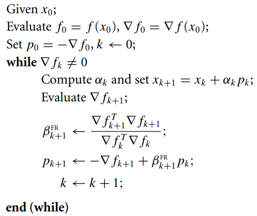

# non-linear Conjugate Gradient


[](http://www.apache.org/licenses/LICENSE-2.0.txt)

A simple implementation of non linear Conjugate Gradient in C/C++ language, in a code::block windows project.

This implementation was created for academic use, but can be [adapted] for commercial usage. 

It is basically the implementation of the algorithm:




## Use Cases

Use this for:

- If you just want a simple, fast, general implementation
- High-latency applications
- Easy to use code to test concepts and modify easily


## Compilation

```
g++.exe -Wall -fexceptions -O2 -Os -Wall -std=c++11 -m64 -Iinclude -c main.cpp -o obj\Release\main.o
g++.exe  -o bin\Release\nonLinearConjugateGradient.exe obj\Release\main.o obj\Release\src\NonLinearCG.o  -s -m64  
```


## Usage

Simple usage:

```c++
int main()
{
    double _deltaX = 0.01;
    double _error = 0.001;
    double _step = 0.01;
    long N = 40;

    // 1 - RANDOM NUMBER INITIALIZATION
    std::default_random_engine generator(std::chrono::system_clock::now().time_since_epoch().count());
    std::uniform_real_distribution<double> distribution(-1000.0, +1000.0);

    // 2 - DEFINITION OF DECISION VARIABLE X VECTOR
    vector<double> x(N, 0.0);
    for(int i=0;i<N;i++)
        x[i] = distribution(generator);
    cout<< "-------------------------------------------"<< endl;

    // 3 - DEFINITION OF THE OBJECT ASSOCIATED TO THE METHOD
    NonLinearCG nlCG(_error, _step, _deltaX, x, f, true);

    // 4 - EXECUTION OF THE METHOD
    cout<< "EXECUTING ..."<< endl;
    nlCG.execute();

    // 5 - SHOW THE SOLUTION FOUND
    cout<< "-------------------------------------------"<< endl;
    cout<< "min F(X*): "<< f(x) << endl;

    return 0;
}

```

The code above is an example of a simple way to use the target class call NonLinearCG. 
follow the steps:


1. Random number initialization. After this, numbers between the intervals [-1000, +1000] can be generated.

2. Definition of a vector of N size, which will be used as a decision variable vector.

3. Here is needed to instantiate the object NonLinearCG() and the following parameters is obligatory:
  - error: used as a stop criterion to finish the iterative process of the method;
  - step: the known "alpha" variable used into the method in order to define the size of step of convergence; 
  - deltaX: the size used in the differentiation dy/dx;
  - x: the decision variable vector;
  - f: function which one wants to find the minimum value. An example of sphere function could be something like this:

```c++
double f(vector<double> &x)
{
    double r=0.0;
    //Sphere function
    for(int i=0;i<x.size();i++)
        r += (x[i] * x[i]);
    return r;
} 
```
 
  - printable: a parameter to indicate to print the inner execution informations;
 
4. Execution of the method by calling execute() function.

5. Show the X vector results.


## References:

* [Conjugate gradient method](<https://en.wikipedia.org/wiki/Conjugate_gradient_method> "Wikipedia:Conjugate gradient method")

